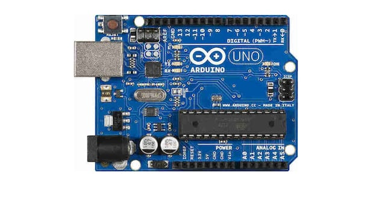
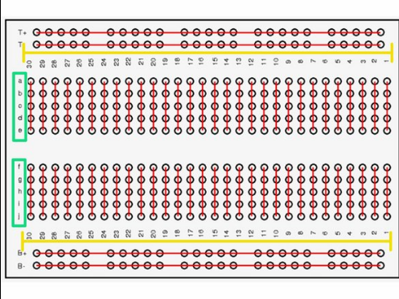
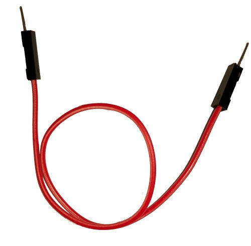
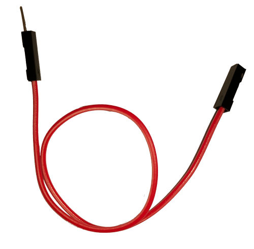
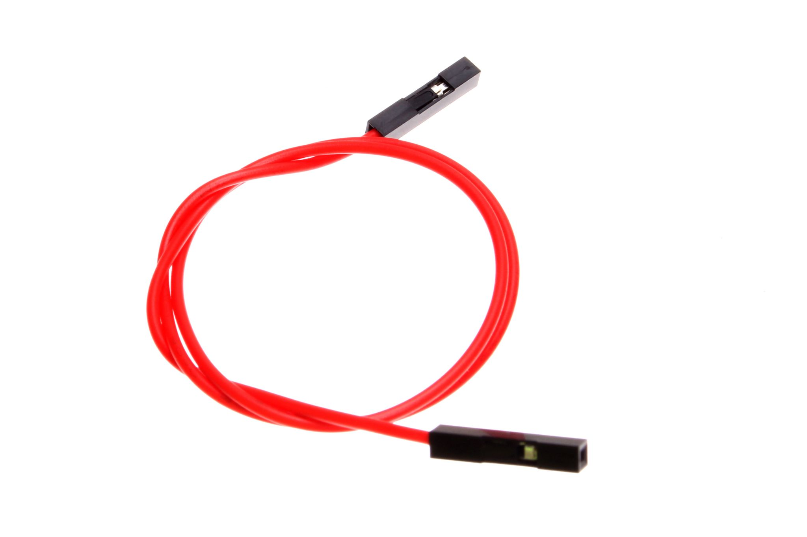
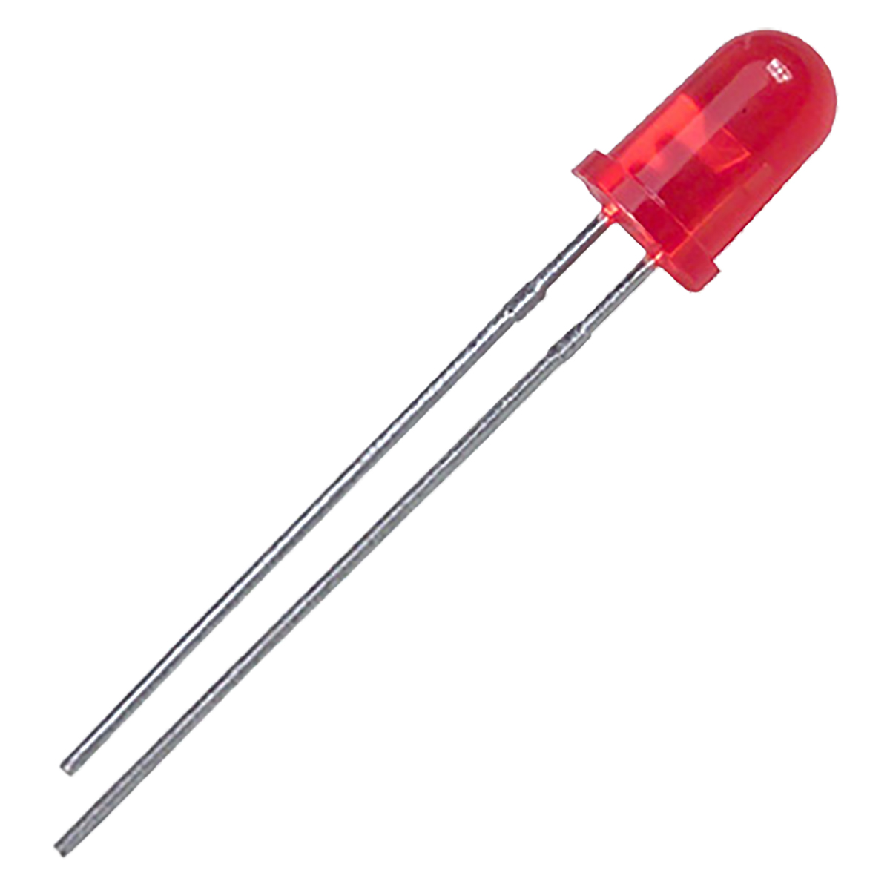

___
ຊື່ ແລະ ນາມສະກຸນ: ທ. ຄິມຫັນ ສີປະເສີດ                          ລໍາດັບ: 1                                      ຫ້ອງ:3COM2

									ວຽກບ້ານ MCU & MPU

🔖 **Arduino Starter Kit***
___
# 🔌core boards & interfaces

1. Arduino Uno board
	**ການໃຊ້ງານຂອງອຸປະກອນ:** Arduino Uno ແມ່ນບອດ Microcontroller ມັນເຮັດວຽກໂດຍການອ່ານຄ່າຈາກອຸປະກອນຮັບເຂົ້າ (Input) ເຊັ່ນ: ເຊັນເຊີ ຫຼື Button, ປະມວນຜົນຕາມໂປຣແກຣມທີ່ຂຽນໄວ້, ແລະ ສັ່ງການໄປຫາອຸປະກອນ Output ເຊັ່ນ: LED, Monitor ຫຼື ຈໍສະແດງຜົນ.

	🔌Arduino Uno ມີຂາຫຼັກໆ (PINOUT) ແບ່ງອອກເປັນ 3 ພາກສ່ວນຄື:
	ຂາດິຈິຕອລ (Digital Pins)
	- ມີທັງໝົດ **14 ຂາ** (0ເຖິງ 13).
	- ໃຊ້ສຳລັບການປ້ອນ/ສົ່ງຂໍ້ມູນແບບ **ເປີດ (HIGH)** ຫຼື **ປິດ (LOW)**.
	- **PWM Pins (~):** 6 ຂາ (3, 5, 6, 9, 10, 11) ທີ່ສາມາດຄວບຄຸມຄ່າແບບ Analog ໄດ້ (ເຊັ່ນ: ປັບຄວາມສະຫວ່າງຂອງໄຟ).
	- **ສື່ສານ Serial:**
	    - **RX (0):** ຮັບຂໍ້ມູນ.
	    - **TX (1):** ສົ່ງຂໍ້ມູນ.
        
	ຂາ Analog (Analog Input Pins)
	- ມີທັງໝົດ **6 ຂາ** (A0 ເຖິງ A5).
	- ໃຊ້ສຳລັບການອ່ານຄ່າທີ່ປ່ຽນແປງຢ່າງຕໍ່ເນື່ອງຈາກເຊັນເຊີ (ເຊັ່ນ: ວັດແສງ, ວັດອຸນຫະພູມ).
	    
	ຂາໄຟຟ້າ (Power Pins)
	- **GND:** ຂາພື້ນດິນ (Ground) ຫຼື ຂາລົບ.
	- **5V ແລະ 3.3V:** ຂາສະໜອງໄຟຟ້າອອກນອກໃຫ້ອຸປະກອນອື່ນ.
	- **VIN:** ຂາສຳລັບຕໍ່ແຫຼ່ງຈ່າຍໄຟພາຍນອກ (7V ຫາ 12V).
	- **RESET:** ຂາສຳລັບຣີສະຕາດໂປຣແກຣມ.
		ຮູບພາບອຸປະກອນຕົວຈິງ:
	
	
		
	ຮູບອຸປະກອນແບບ Schematic Diagram :
	
	

	ຕົວຢ່າງການນຳໃຊ້:
	Blink LED: ໃຊ້ຂາ Digital Output ເພື່ອຄວບຄຸມການເປີດ-ປິດໄຟ LED ເປັນຈັງຫວະ

2. Breadboards
	**ການໃຊ້ງານຂອງອຸປະກອນ:** Breadboard ແມ່ນເຄື່ອງມືສຳລັບການສ້າງແບບຈຳລອງວົງຈອນເອເລັກໂຕຣນິກ ເຮັດໃຫ້ສາມາດເຊື່ອມຕໍ່ອຸປະກອນຕ່າງໆ (ເຊັ່ນ: Arduino, Resistors, LEDs, ICs) ເຂົ້າກັນ ເພື່ອທົດສອບ ແລະ ປັບປ່ຽນວົງຈອນໄດ້ງ່າຍ.

	ຮູບພາບອຸປະກອນຕົວຈິງ:
	
	
		
	ຮູບອຸປະກອນແບບ Schematic Diagram :
	
	
	
	ຕົວຢ່າງການນຳໃຊ້:
	ສ້າງວົງຈອນໄຟ LED ກະພິບໂດຍການວາງ LED, ຕົວຕ້ານທານ, ແລະ ສາຍເຊື່ອມຕໍ່ກັບ Arduino Uno.

1. USB Cable
	**ການໃຊ້ງານຂອງອຸປະກອນ:** 
	- **ການສື່ສານຂໍ້ມູນ:** ໃຊ້ສຳລັບການອັບໂຫຼດໂປຣແກຣມ (Sketch) ຈາກຄອມພິວເຕີໄປຍັງ Microcontroller ຂອງ Arduino. ນອກຈາກນີ້ຍັງໃຊ້ສຳລັບການສື່ສານແບບ Serial (ເຊັ່ນ: ການສົ່ງຂໍ້ມູນຈາກ Arduino ກັບໄປຄອມພິວເຕີເພື່ອດີບັກ ຫຼື ສະແດງຜົນ).
	- **ການຈ່າຍໄຟ:** ໃຊ້ສຳລັບຈ່າຍໄຟຟ້າ (+5V) ຈາກຄອມພິວເຕີໄປຍັງ Arduino Uno ເພື່ອໃຫ້ບອດສາມາດເຮັດວຽກໄດ້.

	ຮູບພາບອຸປະກອນຕົວຈິງ:
	
	
		
	ຕົວຢ່າງການນຳໃຊ້:
	- Programming: ເຊື່ອມຕໍ່ Arduino ເຂົ້າກັບຄອມພິວເຕີເພື່ອຂຽນ ແລະ ອັບໂຫຼດໂປຣແກຣມໃໝ່.
	- Serial Monitor: ໃຊ້ສາຍນີ້ເພື່ອເປີດ Serial Monitor ໃນ Arduino IDE ເພື່ອເບິ່ງຂໍ້ຄວາມ ຫຼື ຄ່າຈາກເຊັນເຊີທີ່ Arduino ສົ່ງມາ.
___
# 🧵 Wiring & Connectors

 4. Jumper wires (male-to-male)
 
	**ການໃຊ້ງານຂອງອຸປະກອນ:** Jumper Wires ແມ່ນສາຍສຳລັບເຊື່ອມຕໍ່ທາງໄຟຟ້າລະຫວ່າງອົງປະກອບຕ່າງໆໃນວົງຈອນເອເລັກໂຕຣນິກ, ໂດຍສະເພາະແມ່ນການເຊື່ອມຕໍ່ລະຫວ່າງ Arduino Uno, Breadboard, ແລະ Modules/Components ອື່ນໆ.

	ຮູບພາບອຸປະກອນຕົວຈິງ:
	

	**ຕົວຢ່າງການນຳໃຊ້:**
	**M-to-M:** ເຊື່ອມຕໍ່ຂາ Digital ຂອງ Arduino ໄປຫາຈຸດໜຶ່ງໃນ Breadboard.

5. Jumper wires (male-to-female)

	**ການໃຊ້ງານຂອງອຸປະກອນ:** Jumper Wires ແມ່ນສາຍສຳລັບເຊື່ອມຕໍ່ທາງໄຟຟ້າລະຫວ່າງອົງປະກອບຕ່າງໆໃນວົງຈອນເອເລັກໂຕຣນິກ, ໂດຍສະເພາະແມ່ນການເຊື່ອມຕໍ່ລະຫວ່າງ Arduino Uno, Breadboard, ແລະ Modules/Components ອື່ນໆ.

	ຮູບພາບອຸປະກອນຕົວຈິງ:
	

	**ຕົວຢ່າງການນຳໃຊ້:**
	**M-to-F:** ເຊື່ອມຕໍ່ຂາ Power (5V) ຂອງ Arduino ໄປຫາຂາ VCC ຂອງ Sensor Module.

6. Jumper wires (female-to-female)

	**ການໃຊ້ງານຂອງອຸປະກອນ:** Jumper Wires ແມ່ນສາຍສຳລັບເຊື່ອມຕໍ່ທາງໄຟຟ້າລະຫວ່າງອົງປະກອບຕ່າງໆໃນວົງຈອນເອເລັກໂຕຣນິກ, ໂດຍສະເພາະແມ່ນການເຊື່ອມຕໍ່ລະຫວ່າງ Arduino Uno, Breadboard, ແລະ Modules/Components ອື່ນໆ.

	ຮູບພາບອຸປະກອນຕົວຈິງ:
	

	**ຕົວຢ່າງການນຳໃຊ້:**
	**F-to-F:** ເຊື່ອມຕໍ່ຂາສັນຍານ I2C (SDA, SCL) ໂດຍກົງລະຫວ່າງ Arduino ກັບ I2C LCD Module.

7. 9V Battery Connector
	**ການໃຊ້ງານຂອງອຸປະກອນ:** ໃຊ້ເປັນຫົວຕໍ່ ແບັດເຕີຣີ 9V ກັບ Arduino Uno ເພື່ອຈ່າຍໄຟຟ້າໃຫ້ກັບ Arduino Uno ໂດຍກົງຈາກແບັດເຕີຣີ 9V

	ຮູບພາບອຸປະກອນຕົວຈິງ:
	

	**ຕົວຢ່າງການນຳໃຊ້:**
	ໃຊ້ພື່ອຈ່າຍໄຟເປັນແຫຼ່ງພະລັງງານສຳລັບຫຸ່ນຍົນນ້ອຍ ຫຼື ລະບົບຄວບຄຸມໄລຍະໄກທີ່ໃຊ້ Arduino.  

---

# 💡 Basic Components

 8. LEDs (Red, Yellow, Blue, RGB)

	**ການໃຊ້ງານຂອງອຸປະກອນ:** LEDs ແມ່ນໄດໂອດທີ່ປ່ອຍແສງອອກມາເມື່ອມີກະແສໄຟຟ້າໄຫຼຜ່ານໃນທິດທາງທີ່ຖືກຕ້ອງ (ຈາກ Anode ໄປຫາ Cathode). ໃຊ້ເປັນຕົວຊີ້ບອກສະຖານະພາບ (ເຊັ່ນ: ເປີດ/ປິດ, ເຮັດວຽກ), ຫຼື ເປັນອົງປະກອບຂອງການສະແດງຜົນທາງສາຍຕາ. ຕ້ອງຕໍ່ກັບຕົວຕ້ານທານ (ເຊັ່ນ: 220Ω) ເພື່ອຈຳກັດກະແສໄຟຟ້າ ແລະ ປ້ອງກັນບໍ່ໃຫ້ LED ເສຍຫາຍ.
	
	**ຮູບພາບອຸປະກອນຕົວຈິງ:** 
	
	**ຮູບອຸປະກອນແບບ Schematic Diagram:**
	
	**ຕົວຢ່າງການນຳໃຊ້:**
	**Status Indicator:** ໃຊ້ໄຟສີແດງເພື່ອຊີ້ບອກວ່າລະບົບປິດຢູ່ ແລະ ສີຂຽວເພື່ອຊີ້ບອກວ່າລະບົບເປີດຢູ່.
    

9. RGB module
	**ການໃຊ້ງານຂອງອຸປະກອນ:** RGB LED ແມ່ນການລວມເອົາໄຟ LED ສາມດອກ (ແດງ, ຂຽວ, ຟ້າ) ໄວ້ໃນກ່ອງດຽວ. ມັນເຮັດວຽກໂດຍອີງໃສ່ຫຼັກການປະສົມສີແບບເພີ່ມ (Additive Color Mixing). ໂດຍການຄວບຄຸມຄວາມເຂັ້ມຂອງແສງສາມສີຫຼັກນີ້, ມັນສາມາດຜະລິດສີທີ່ແຕກຕ່າງກັນໄດ້ຫຼາຍລ້ານສີ.
	
	**ຮູບພາບອຸປະກອນຕົວຈິງ:** 
	
	**ຮູບອຸປະກອນແບບ Schematic Diagram:**
	
	**ຕົວຢ່າງການນຳໃຊ້:**
	- **RGB Mood Light:** ໃຊ້ PWM ຂອງ Arduino ເພື່ອຄວບຄຸມຄວາມເຂັ້ມຂອງສີແດງ, ສີຂຽວ, ແລະ ສີຟ້າ ຂອງ RGB LED ເພື່ອສ້າງສີປະສົມທີ່ແຕກຕ່າງກັນ.

10. Resistors (220Ω, 1kΩ, 10kΩ)

	**ການໃຊ້ງານຂອງອຸປະກອນ:** ຕົວຕ້ານທານມີໜ້າທີ່ຫຼັກຄືການ **ຕ້ານ** ການໄຫຼຂອງກະແສໄຟຟ້າໃນວົງຈອນ. ມັນຖືກໃຊ້ເພື່ອ:
	1. **ຈຳກັດກະແສໄຟຟ້າ:** ປ້ອງກັນບໍ່ໃຫ້ກະແສໄຟຟ້າຫຼາຍເກີນໄປໄຫຼເຂົ້າໄປໃນອຸປະກອນທີ່ອ່ອນໄຫວ (ເຊັ່ນ: LED). (ມັກໃຊ້ 220Ω ຫາ 1kΩ ສຳລັບ LED).
	2. **ແບ່ງແຮງດັນ (Voltage Divider):** ໃຊ້ສອງຕົວຕ້ານທານຮ່ວມກັນເພື່ອຫຼຸດແຮງດັນລົງ.
	    
	**ຮູບພາບອຸປະກອນຕົວຈິງ:**
	
	**ຮູບອຸປະກອນແບບ Schematic Diagram:**
	
	**ຕົວຢ່າງການນຳໃຊ້:**
	**LED Protection:** ຕໍ່ຕົວຕ້ານທານ 220Ω ກັບ LED ເພື່ອປ້ອງກັນບໍ່ໃຫ້ LED ເສຍຫາຍ.   
	
11. Push Buttons (x4 with Lids)

	**ການໃຊ້ງານຂອງອຸປະກອນ:** ປຸ່ມກົດເຮັດໜ້າທີ່ເປັນອຸປະກອນຮັບເຂົ້າ (Input) ທີ່ປິດ ຫຼື ເປີດວົງຈອນຊົ່ວຄາວ. ເມື່ອກົດປຸ່ມ, ມັນຈະເຮັດໃຫ້ກະແສໄຟຟ້າໄຫຼ ຫຼື ຢຸດໄຫຼ ເຊິ່ງ Arduino ສາມາດອ່ານການປ່ຽນແປງສະຖານະນີ້ໄດ້ຜ່ານຂາ Digital Input.
	
	**ຮູບພາບອຸປະກອນຕົວຈິງ:** 
	
	**ຮູບອຸປະກອນແບບ Schematic Diagram:**
	
	**ຕົວຢ່າງການນຳໃຊ້:**
	- **Control Light:** ໃຊ້ປຸ່ມກົດເພື່ອເປີດ/ປິດໄຟ LED.
	- **Mode Selector:** ໃຊ້ປຸ່ມກົດຫຼາຍອັນເພື່ອເລືອກໂໝດການເຮັດວຽກທີ່ແຕກຕ່າງກັນສຳລັບໂປຣເຈັກ.
    
12. Potentiometer (5kΩ)

	**ການໃຊ້ງານຂອງອຸປະກອນ:** Potentiometer ແມ່ນຕົວຕ້ານທານທີ່ສາມາດປັບຄ່າໄດ້. ໃນການນຳໃຊ້ກັບ Arduino, ມັນມັກຖືກໃຊ້ເປັນ **Voltage Divider** ເພື່ອຜະລິດສັນຍານແຮງດັນອະນາລັອກທີ່ປ່ຽນແປງໄດ້ (ຈາກ 0V ຫາ 5V) ໃຫ້ Arduino ອ່ານຄ່າຜ່ານຂາ Analog Input. ຜູ້ໃຊ້ສາມາດປັບຄ່າໄດ້ໂດຍການໝູນປຸ່ມ.
	
	**ຮູບພາບອຸປະກອນຕົວຈິງ:** 
	
	**ຮູບອຸປະກອນແບບ Schematic Diagram:**
	
	**ຕົວຢ່າງການນຳໃຊ້:**
	**Input Control:** ໃຊ້ເພື່ອຄວບຄຸມຄວາມສະຫວ່າງຂອງ LED (ໂດຍການປັບຄ່າ PWM) ຫຼື ຄວາມໄວຂອງມໍເຕີ.
    

13. Active Buzzer

	**ການໃຊ້ງານຂອງອຸປະກອນ:** Buzzer ໃຊ້ສຳລັບການຜະລິດສຽງ (Output).
	**Active Buzzer:** ໃຊ້ສຳລັບສັນຍານເຕືອນ ຫຼື ສຽງແຈ້ງເຕືອນແບບງ່າຍໆ (ເຊັ່ນ: ສຽງ Beep ເມື່ອມີຂໍ້ຜິດພາດ). ເຊື່ອມຕໍ່ກັບຂາ Digital ຂອງ Arduino ເພື່ອເປີດ/ປິດ.
	
	**ຮູບພາບອຸປະກອນຕົວຈິງ:** 
	
	**ຮູບອຸປະກອນແບບ Schematic Diagram:**
	
	**ຕົວຢ່າງການນຳໃຊ້:**
	**Alarm System:** ໃຊ້ Active Buzzer ເພື່ອສົ່ງສັນຍານເຕືອນເມື່ອເຊັນເຊີກວດພົບການເຄື່ອນໄຫວ.

14. Passive Buzzer

	**ການໃຊ້ງານຂອງອຸປະກອນ:** Buzzer ໃຊ້ສຳລັບການຜະລິດສຽງ (Output).
	**Passive Buzzer:** ໃຊ້ສຳລັບສຽງທີ່ສັບຊ້ອນກວ່າ ເຊັ່ນ: ສຽງດົນຕຣີ, ສຽງເອັບເຟັກ ຫຼື ສຽງເຕືອນທີ່ມີຄວາມຖີ່ປ່ຽນແປງໄດ້. ເຊື່ອມຕໍ່ກັບຂາ PWM ຂອງ Arduino ເພື່ອຄວບຄຸມຄວາມຖີ່.
	    
	
	**ຮູບພາບອຸປະກອນຕົວຈິງ:** 
	
	**ຮູບອຸປະກອນແບບ Schematic Diagram:**
	
		
	**ຕົວຢ່າງການນຳໃຊ້:**
	**Playing Music:** ໃຊ້ Passive Buzzer ເພື່ອຫຼິ້ນເພງງ່າຍໆໂດຍການປ່ຽນຄວາມຖີ່ຂອງສັນຍານທີ່ປ້ອນເຂົ້າ.
___
# 📟 Displays & Output

15. 16x2 LCD display
	
	**ການໃຊ້ງານຂອງອຸປະກອນ:** ຈໍ LCD 16x2 ໃຊ້ສຳລັບການສະແດງຜົນຂໍ້ຄວາມສັ້ນໆ (16 ຕົວອັກສອນຕໍ່ແຖວ, ສອງແຖວ). ມັນເປັນອຸປະກອນ Output ທີ່ສຳຄັນສຳລັບການສະແດງຄ່າຈາກເຊັນເຊີ, ສະຖານະພາບຂອງລະບົບ ຫຼື ຂໍ້ຄວາມຂອງຜູ້ໃຊ້ໂດຍກົງ. ເນື່ອງຈາກມັນໃຊ້ຂາຫຼາຍ (6-11 ຂາ) ໃນການເຊື່ອມຕໍ່ກັບ Arduino, ມັນມັກຈະຖືກໃຊ້ຄູ່ກັບ **I2C Serial Adapter Board** ເພື່ອຫຼຸດການໃຊ້ຂາຂອງ Arduino ລົງເຫຼືອພຽງ 2 ຂາ (SDA, SCL).

	**ຮູບພາບອຸປະກອນຕົວຈິງ:** 
	
	**ຮູບອຸປະກອນແບບ Schematic Diagram:**
	

	**ຕົວຢ່າງການນຳໃຊ້:**
	- **Weather Station:** ສະແດງຄ່າອຸນຫະພູມ ແລະ ຄວາມຊຸ່ມຊື່ນທີ່ອ່ານໄດ້ຈາກ DHT11.
	- **Counter:** ສະແດງຈຳນວນຄັ້ງທີ່ປຸ່ມກົດຖືກກົດ
	- **Menu:** ສະແດງເມນູເລືອກໂໝດການເຮັດວຽກຂອງໂປຣເຈັກ.

16. I2C Serial Adapter board module

	**ການໃຊ້ງານຂອງອຸປະກອນ:** ໂມດູນນີ້ມີ IC ຂັບ (ເຊັ່ນ: PCF8574) ທີ່ເຮັດໜ້າທີ່ປ່ຽນການສື່ສານແບບ Parallel ຂອງຈໍ LCD ໃຫ້ເປັນການສື່ສານແບບອະນຸກົມ **I2C (Inter-Integrated Circuit)**. ການໃຊ້ໂມດູນນີ້ຈະຫຼຸດຈຳນວນຂາທີ່ຕ້ອງເຊື່ອມຕໍ່ຈາກ Arduino ໄປຫາ LCD ຈາກ 7-11 ຂາ ລົງເຫຼືອພຽງ **4 ຂາ** (VCC, GND, SDA, SCL), ເຊິ່ງຊ່ວຍປະຢັດຂາ I/O ຂອງ Arduino ໄວ້ສຳລັບອຸປະກອນອື່ນໆ.
	
	**ຮູບພາບອຸປະກອນຕົວຈິງ:** 
	
	**ຮູບອຸປະກອນແບບ Schematic Diagram:**		
	
	
	**ຕົວຢ່າງການນຳໃຊ້:**
	- **Minimal Wiring Project:** ເຊື່ອມຕໍ່ຈໍ LCD ກັບ Arduino ໂດຍໃຊ້ພຽງ 4 ສາຍເພື່ອປະຫຍັດຂາ I/O.
	- **Data Logging:** ໃຊ້ເພື່ອສະແດງຜົນຂໍ້ມູນເຊັນເຊີຫຼາຍອັນ ພ້ອມທັງໃຊ້ຂາອື່ນໆສຳລັບ SD Card Module ຫຼື Module ອື່ນໆ.

17. 7-segment display (Common Cathode +)

**ການໃຊ້ງານຂອງອຸປະກອນ:** ຈໍ 7-Segment ໃຊ້ສຳລັບການສະແດງຜົນຕົວເລກ (0-9) ແລະ ຕົວອັກສອນບາງຕົວ.
- **Common Cathode:** ເພື່ອເປີດໄຟ LED ໃນສ່ວນໃດໜຶ່ງ, ຕ້ອງຈ່າຍໄຟ **HIGH (5V)** ໄປຫາຂາຄວບຄຸມສ່ວນນັ້ນ. ຂາ Common ຕ້ອງຕໍ່ກັບ GND.
- ການຄວບຄຸມ: ຕ້ອງໃຊ້ 8 ຂາ Digital Output ຂອງ Arduino ເພື່ອຄວບຄຸມ Segment ທັງໝົດ, ເຊິ່ງມັກຈະໃຊ້ IC ຂັບ (ເຊັ່ນ: 74HC595) ເພື່ອຫຼຸດການໃຊ້ຂາ.
    
**ຮູບພາບອຸປະກອນຕົວຈິງ:** 

**ຮູບອຸປະກອນແບບ Schematic Diagram:**	

**ຕົວຢ່າງການນຳໃຊ້:**
- **Simple Counter:** ສະແດງຕົວເລກນັບຂຶ້ນ ຫຼື ນັບລົງ.
- **Game Score:** ສະແດງຄະແນນໃນເກມແບບງ່າຍໆ.

18. 4-Digit 7-Segment Display

	**ການໃຊ້ງານຂອງອຸປະກອນ:** ໃຊ້ສຳລັບການສະແດງຜົນຕົວເລກ 4 ຫຼັກ. ເພື່ອໃຫ້ສາມາດສະແດງຜົນ 4 ຫຼັກໄດ້ພ້ອມກັນ, ມັນໃຊ້ເທັກນິກທີ່ເອີ້ນວ່າ **Multiplexing** (ການເປີດ-ປິດຫຼັກຕ່າງໆຢ່າງໄວວາ), ເຮັດໃຫ້ຕາຂອງຄົນເຫັນຄືກັບວ່າສະແດງຜົນພ້ອມກັນຕະຫຼອດເວລາ.
	
	**ຮູບພາບອຸປະກອນຕົວຈິງ:** 
	
	**ຮູບອຸປະກອນແບບ Schematic Diagram:**	
	
	
	**ຕົວຢ່າງການນຳໃຊ້:**
	- **Digital Clock/Timer:** ສະແດງຊົ່ວໂມງ ຫຼື ເວລານັບຖອຍຫຼັງ.
	- **Voltmeter/Thermometer:** ສະແດງຄ່າແຮງດັນ ຫຼື ອຸນຫະພູມທີ່ມີຕົວເລກ 4 ຫຼັກ.

19. 8x8 Dot Matrix display

	**ການໃຊ້ງານຂອງອຸປະກອນ:** ຈໍ 8x8 Dot Matrix ໃຊ້ສຳລັບການສະແດງຜົນຮູບພາບ, ຮູບແບບ (Patterns), ຂໍ້ຄວາມແບບເລື່ອນ (Scrolling Text) ຫຼື ຮູບພາບແບບ Pixel Art ທີ່ມີຄວາມລະອຽດຕ່ຳ. ເຮັດວຽກໂດຍການຄວບຄຸມແຕ່ລະຈຸດ (Pixel) ໃນຕາໜ່າງ 8x8 ໂດຍແຍກກັນ.
	
	**ຮູບພາບອຸປະກອນຕົວຈິງ:** 
	
	**ຮູບອຸປະກອນແບບ Schematic Diagram:**
	
	**ຕົວຢ່າງການນຳໃຊ້:**
	- **Scrolling Text:** ສະແດງຂໍ້ຄວາມຂະໜາດສັ້ນແບບເລື່ອນໄປມາ.
	- **Simple Animation:** ສ້າງພາບເຄື່ອນໄຫວງ່າຍໆ ຫຼື ຮູບພາບ Pixel Art.
	- **Game Display:** ສະແດງຜົນໃນເກມແບບເກົ່າ (ເຊັ່ນ: Tetris ຫຼື Snake).
___
# 📡 Sensors & Input Modules

20. Temperature and humidity sensor (DHT11)

	**ການໃຊ້ງານຂອງອຸປະກອນ:** DHT11 ໃຊ້ສຳລັບວັດແທກຄ່າອຸນຫະພູມ (Temperature) ແລະ ຄວາມຊຸ່ມຊື່ນສຳພັດ (Relative Humidity) ຂອງອາກາດອ້ອມຂ້າງ. ມັນສົ່ງຂໍ້ມູນອອກມາເປັນສັນຍານດິຈິຕອລ (Digital Signal) ພຽງ 1 ສາຍ, ເຮັດໃຫ້ການເຊື່ອມຕໍ່ງ່າຍຂຶ້ນ.
	
	**ຮູບພາບອຸປະກອນຕົວຈິງ:** 
	
	**ຮູບອຸປະກອນແບບ Schematic Diagram:**
	
	
	**ຕົວຢ່າງການນຳໃຊ້:**
	- **Environmental Monitoring:** ສ້າງລະບົບຕິດຕາມສະພາບແວດລ້ອມໃນເຮືອນ ຫຼື ສວນ.
	- **Thermostat:** ຄວບຄຸມເຄື່ອງປັບອາກາດ ຫຼື ພັດລົມໂດຍອີງໃສ່ຄ່າອຸນຫະພູມ ແລະ ຄວາມຊຸ່ມຊື່ນ.

21. LM35 Temperature Sensor

	**ການໃຊ້ງານຂອງອຸປະກອນ:**
	LM35 ແມ່ນເຊັນເຊີອຸນຫະພູມທີ່ມີຄວາມແມ່ນຍໍາສູງ ເຊິ່ງໃຫ້ຄ່າອອກມາເປັນສັນຍານ ອະນາລັອກ (Analog Voltage) ໂດຍກົງເປັນອົງສາເຊລຊຽສ ($\text{}^\circ\text{C}$).
	- **ຫຼັກການ:** ແຮງດັນໄຟຟ້າທີ່ອອກມາຈະປ່ຽນແປງ $10\text{mV}$ ຕໍ່ $1\text{}^\circ\text{C}$ (ເຊັ່ນ: ທີ່ $25\text{}^\circ\text{C}$, ມັນຈະໃຫ້ຄ່າອອກ $250\text{mV}$ ຫຼື $0.25\text{V}$).
	- ເຊື່ອມຕໍ່ກັບຂາ **Analog Input** (A0-A5) ຂອງ Arduino.
	    
	**ຮູບພາບອຸປະກອນຕົວຈິງ:** 
	
	
	**ຕົວຢ່າງການນຳໃຊ້:**
	- **Precision Temperature Gauge:** ສ້າງເຄື່ອງວັດອຸນຫະພູມທີ່ສະແດງຜົນໃນຈໍ LCD ດ້ວຍຄວາມລະອຽດສູງ.
	- **Overheat Protection:** ໃຊ້ຕິດຕາມອຸນຫະພູມຂອງອຸປະກອນເອເລັກໂຕຣນິກ ແລະ ສັ່ງການປິດເມື່ອຮ້ອນເກີນໄປ.

22. Tilt sensor (x2)

	**ການໃຊ້ງານຂອງອຸປະກອນ:** ເຊັນເຊີວັດມຸມອຽງແມ່ນສະວິດແບບງ່າຍໆທີ່ໃຊ້ກົນໄກຂອງແຮງໂນ້ມຖ່ວງ (Gravity). ມັນເຮັດວຽກໂດຍການປ່ຽນສະຖານະຈາກ **ເປີດ (Open Circuit)** ເປັນ **ປິດ (Closed Circuit)** (ຫຼື ກົງກັນຂ້າມ) ເມື່ອມັນອຽງໄປໃນມຸມໃດໜຶ່ງ.
	- ມັນເຮັດໜ້າທີ່ຄືກັບປຸ່ມກົດ, ສົ່ງສັນຍານດິຈິຕອລ (HIGH/LOW) ໄປຫາຂາ Digital Input ຂອງ Arduino.
	- **ຂໍ້ສັງເກດ:** ມັນແຕກຕ່າງຈາກ Accelerometer (ເຊັນເຊີວັດຄວາມເລັ່ງ), ເຊິ່ງວັດມຸມອຽງທີ່ຊັດເຈນ. Tilt Sensor ພຽງແຕ່ບອກວ່າ "ອຽງ" ຫຼື "ບໍ່ອຽງ".
	    
	**ຮູບພາບອຸປະກອນຕົວຈິງ:** 
	
	**ຮູບອຸປະກອນແບບ Schematic Diagram:**
	
	**ຕົວຢ່າງການນຳໃຊ້:**
	- **Motion Detector:** ໃຊ້ເພື່ອກວດພົບວ່າວັດຖຸຖືກຍົກຂຶ້ນ ຫຼື ວາງລົງ.
	- **Security Alarm:** ຕິດຕັ້ງໃສ່ປ່ອງຢ້ຽມ ຫຼື ປະຕູ ເພື່ອສົ່ງສັນຍານເຕືອນເມື່ອມີການເຄື່ອນໄຫວ/ເປີດ.

23. Photoresistor (LDRs x3)

	**ການໃຊ້ງານຂອງອຸປະກອນ:**
	LDR ແມ່ນຕົວຕ້ານທານທີ່ຄ່າຄວາມຕ້ານທານຈະ ປ່ຽນແປງຕາມຄວາມເຂັ້ມຂອງແສງ.
	- **ຄວາມມືດ:** ຄ່າຄວາມຕ້ານທານສູງ (ກະແສໄຟຟ້າໄຫຼຜ່ານຍາກ).
	- **ຄວາມສະຫວ່າງ:** ຄ່າຄວາມຕ້ານທານຕ່ຳ (ກະແສໄຟຟ້າໄຫຼຜ່ານງ່າຍ).
	- **ການເຊື່ອມຕໍ່:** ມັນຕ້ອງຖືກໃຊ້ເປັນສ່ວນໜຶ່ງຂອງ **Voltage Divider** (ຕໍ່ອະນຸກົມກັບຕົວຕ້ານທານຄົງທີ່, ເຊັ່ນ: $10k\Omega$) ເພື່ອຜະລິດສັນຍານແຮງດັນອະນາລັອກທີ່ປ່ຽນແປງໄດ້ໃຫ້ Arduino ອ່ານຄ່າຜ່ານຂາ Analog Input.
	    
	**ຮູບພາບອຸປະກອນຕົວຈິງ:** 
	 
	
	**ຕົວຢ່າງການນຳໃຊ້:**
	- **Automatic Night Light:** ຖ້າຄ່າແສງຕ່ຳກວ່າທີ່ກຳນົດ, ໃຫ້ເປີດໄຟ LED.
	- **Light Intensity Meter:** ວັດແທກຄວາມເຂັ້ມຂອງແສງ ແລະ ສະແດງຜົນ.

24. PIR Motion sensor (HC-SR501)

	**ການໃຊ້ງານຂອງອຸປະກອນ:** PIR (Passive Infrared) sensor ໃຊ້ກວດຈັບການເຄື່ອນໄຫວໂດຍອີງໃສ່ການປ່ຽນແປງຂອງຄວາມຮ້ອນ (Infrared Radiation) ຈາກຮ່າງກາຍຂອງຄົນ ຫຼື ສັດ.
	- **ຫຼັກການ:** ເມື່ອມີການເຄື່ອນໄຫວໃນຂອບເຂດ, ສັນຍານ Output ຈະປ່ຽນຈາກ **LOW** ເປັນ **HIGH** ເຊິ່ງເປັນສັນຍານ **ດິຈິຕອລ** ທີ່ສາມາດອ່ານໄດ້ໂດຍກົງຈາກ Arduino.
	- ມັນເປັນອຸປະກອນ Input ທີ່ໃຫ້ຜົນລັບພຽງສອງສະຖານະຄື: **ກວດພົບ** (HIGH) ຫຼື **ບໍ່ກວດພົບ** (LOW).
	    
	**ຮູບພາບອຸປະກອນຕົວຈິງ:** 
	
	
	**ຕົວຢ່າງການນຳໃຊ້:**
	- **Security Alarm:** ສັ່ງການ Buzzer ເຕືອນເມື່ອກວດພົບການເຄື່ອນໄຫວ.
	- **Automatic Lighting:** ເປີດໄຟ LED ເມື່ອຄົນເຂົ້າໄປໃນຫ້ອງ ແລະ ປິດເມື່ອອອກໄປ.

25. Ultrasonic module (HC-SR04)

	**ການໃຊ້ງານຂອງອຸປະກອນ:**
	ໃຊ້ໃນການວັດແທກ ໄລຍະທາງ ໄປຫາວັດຖຸໂດຍໃຊ້ຄື້ນສຽງ Ultrasonic.
	- **ຫຼັກການ:** Arduino ສົ່ງສັນຍານ HIGH ໄປຫາຂາ Trig ເປັນເວລາ $10\mu\text{s}$ ເພື່ອໃຫ້ເຊັນເຊີປ່ອຍຄື້ນສຽງ. ເມື່ອຄື້ນສຽງກະທົບວັດຖຸ ແລະ ສະທ້ອນກັບ, ຂາ Echo ຈະເປັນ HIGH. Arduino ວັດແທກໄລຍະເວລາທີ່ Echo ເປັນ HIGH ($t$).
	- **ການຄຳນວນໄລຍະທາງ:** ໄລຍະທາງ (Distance) = $\frac{\text{Speed of sound} \times t}{2}$.
	    
	**ຮູບພາບອຸປະກອນຕົວຈິງ:** 
	
	
	**ຕົວຢ່າງການນຳໃຊ້:**
	- **Obstacle Avoidance Robot:** ຫຸ່ນຍົນໃຊ້ກວດຈັບສິ່ງກີດຂວາງ.
	- **Parking Assist Sensor:** ລະບົບຊ່ວຍຈອດລົດແບບງ່າຍໆ.
	- **Water Level Measurement:** ວັດແທກລະດັບນ້ຳໃນຖັງໂດຍບໍ່ຕ້ອງສຳຜັດກັບນ້ຳ.

26. Sound sensor module
	
	**ການໃຊ້ງານຂອງອຸປະກອນ:** ໃຊ້ສຳລັບກວດຈັບການມີຢູ່ ຫຼື ວັດແທກລະດັບຄວາມດັງຂອງສຽງອ້ອມຂ້າງ.
	- **AOUT:** ໃຊ້ວັດແທກຄວາມດັງສຽງແບບຕໍ່ເນື່ອງ (ເຊັ່ນ: ເພື່ອເຮັດໃຫ້ໄຟ LED ສະຫວ່າງຂຶ້ນຕາມຄວາມດັງຂອງເພງ). ເຊື່ອມຕໍ່ກັບຂາ Analog.
	- **DOUT:** ໃຊ້ສຳລັບການກວດຈັບສຽງທີ່ມີຄວາມດັງສູງ (ເຊັ່ນ: ສຽງຕົບມື). ເຊື່ອມຕໍ່ກັບຂາ Digital.
	    
	**ຮູບພາບອຸປະກອນຕົວຈິງ:** 
	
	
	**ຕົວຢ່າງການນຳໃຊ້:**
	- **Clap Switch:** ເປີດ/ປິດໄຟດ້ວຍການຕົບມື.
	- **Noise Monitoring:** ກວດສອບວ່າສຽງໃນຫ້ອງເກີນຂີດຈຳກັດທີ່ກຳນົດໄວ້ຫຼືບໍ່.

27. Water sensor module

	**ການໃຊ້ງານຂອງອຸປະກອນ:** ໃຊ້ສຳລັບກວດຈັບລະດັບນ້ຳ (ເມື່ອຈຸ່ມລົງໃນນ້ຳ) ຫຼື ກວດຈັບນ້ຳຝົນ (ເມື່ອຕິດຕັ້ງໄວ້ຂ້າງນອກ).
	- **ຫຼັກການ:** ນ້ຳເຮັດໜ້າທີ່ເປັນຕົວນໍາໄຟຟ້າ (Conductivity), ເຊື່ອມຕໍ່ຮ່ອງໂລຫະຕ່າງໆໃນແຜ່ນເຊັນເຊີ ເຮັດໃຫ້ຄວາມຕ້ານທານຫຼຸດລົງ ແລະ ປ່ຽນຄ່າແຮງດັນອອກ.
	- **ການເຊື່ອມຕໍ່:** ໃຊ້ AOUT ສໍາລັບການວັດແທກລະດັບ/ປະລິມານ, ແລະ DOUT ສໍາລັບການກວດຈັບວ່າມີນ້ຳແນ່ນອນບໍ່.
	    
	**ຮູບພາບອຸປະກອນຕົວຈິງ:** 
	
	
	**ຕົວຢ່າງການນຳໃຊ້:**
	- **Rain Alarm:** ສັ່ງການ Buzzer ເຕືອນເມື່ອກວດພົບນ້ຳຝົນ.
	- **Automatic Watering System:** ກວດສອບລະດັບນ້ຳໃນຖັງ.

28. Flame sensor module

	**ການໃຊ້ງານຂອງອຸປະກອນ:**
	ໃຊ້ສຳລັບກວດຈັບແປວໄຟ ຫຼື ແຫຼ່ງຄວາມຮ້ອນອື່ນໆທີ່ປ່ອຍລັງສີ Infrared (ຄວາມຍາວຄື້ນປະມານ $760\text{nm}$ ຫາ $1100\text{nm}$).
	- **ຫຼັກການ:** ແປວໄຟປ່ອຍລັງສີ IR ຢ່າງເຂັ້ມຂຸ້ນ, ເຊິ່ງຖືກກວດຈັບໂດຍ Photodiode.
	- **ການເຊື່ອມຕໍ່:** ໃຊ້ DOUT ເພື່ອເປີດ/ປິດສັນຍານເຕືອນໄພແບບງ່າຍໆ. ໃຊ້ AOUT ເພື່ອວັດແທກຄວາມເຂັ້ມຂອງແປວໄຟ (ເຊັ່ນ: ເພື່ອກຳນົດໄລຍະຫ່າງ).
	    
	**ຮູບພາບອຸປະກອນຕົວຈິງ:** 
	
	
	**ຕົວຢ່າງການນຳໃຊ້:**
	- **Fire Alarm System:** ສັ່ງການ Buzzer ເຕືອນໄພໄໝ້.
	- **Flame Following Robot:** ຫຸ່ນຍົນທີ່ເຄື່ອນທີ່ໄປຫາແຫຼ່ງກຳເນີດໄຟ.

29. . RFID Module (RC522)

	**ການໃຊ້ງານຂອງອຸປະກອນ:**
	ໃຊ້ໃນການອ່ານ ແລະ ຂຽນຂໍ້ມູນໃສ່ບັດ ຫຼື Tag RFID (ຄວາມຖີ່ $13.56\text{MHz}$).
	- **ຫຼັກການ:** ໂມດູນສ້າງສະໜາມແມ່ເຫຼັກໄຟຟ້າ (Electromagnetic Field) ເຊິ່ງຈະເປັນຕົວກະຕຸ້ນໃຫ້ **RFID Tag** (ບັດ/ກະແຈ) ເຮັດວຽກ. ມັນຈະອ່ານຂໍ້ມູນລະຫັດສະເພາະ (UID) ຈາກ Tag ນັ້ນ.
	- **ຂໍ້ຄວນລະວັງ:** RC522 ໃຊ້ໄຟ $3.3\text{V}$. ຖ້າເຊື່ອມຕໍ່ກັບ $5\text{V}$ ໂດຍກົງອາດເຮັດໃຫ້ໂມດູນເສຍຫາຍໄດ້.
	    
	**ຮູບພາບອຸປະກອນຕົວຈິງ:** 
	
	
	**ຕົວຢ່າງການນຳໃຊ້:**
	- **Access Control:** ລະບົບເປີດ/ປິດປະຕູດ້ວຍບັດ.
	- **Asset Tracking:** ລະບົບຕິດຕາມຊັບສິນ.

30. RFID Tag (Card/Key Fob)

	**ການໃຊ້ງານຂອງອຸປະກອນ:** RFID Tag ແມ່ນອົງປະກອບທີ່ຖືກຕິດຕັ້ງໃສ່ວັດຖຸ ຫຼື ຖືກໃຊ້ໂດຍບຸກຄົນ ເພື່ອໃຫ້ **RFID Reader** ສາມາດລະບຸຕົວຕົນ ຫຼື ຕິດຕາມໄດ້.
	- **ຫຼັກການ (Passive Tag):** ບໍ່ມີແບັດເຕີຣີໃນຕົວ. ມັນໄດ້ຮັບພະລັງງານຜ່ານການເໜັງນຳ (Inductive Coupling) ຈາກສະໜາມແມ່ເຫຼັກໄຟຟ້າທີ່ປ່ອຍອອກມາຈາກ RFID Reader (ເຊັ່ນ: RC522). ເມື່ອໄດ້ຮັບພະລັງງານພຽງພໍ, ມັນຈະເປີດໃຊ້ງານ Chip ແລະ ສົ່ງຂໍ້ມູນທີ່ເກັບໄວ້ (ເຊັ່ນ: UID) ກັບຄືນໄປຫາ Reader ຜ່ານຄື້ນວິທະຍຸ.
	    
	**ຮູບພາບອຸປະກອນຕົວຈິງ:** 
	
	
	**ປະເພດຂອງ Tag:**
	1. **Passive Tag (Tags ທີ່ບໍ່ມີແບັດເຕີຣີ):** ຖືກໃຊ້ຫຼາຍທີ່ສຸດໃນໂຄງການ Arduino (ເຊັ່ນ: ບັດ MIFARE S50). ໃຊ້ພະລັງງານຈາກ Reader ເທົ່ານັ້ນ.
	2. **Active Tag (Tags ທີ່ມີແບັດເຕີຣີ):** ສາມາດສົ່ງສັນຍານໄດ້ໄກກວ່າ ແລະ ເປັນໄລຍະ.

31. Infrared receiver

	**ການໃຊ້ງານຂອງອຸປະກອນ:**
	ໃຊ້ເພື່ອ ຮັບ ແລະ ຖອດລະຫັດ (Decode) ສັນຍານ infrared ທີ່ສົ່ງມາຈາກ IR Remote Control (ເຊັ່ນ: ຣີໂມດໂທລະພາບ ຫຼື ຣີໂມດທີ່ມາພ້ອມຊຸດ Kit).
	- **ຫຼັກການ:** IR Receiver (ເຊັ່ນ: VS1838B ຫຼື TSOP Series) ຈະຖືກປັບໃຫ້ຮັບຄື້ນ infrared ຄວາມຖີ່ສະເພາະ (ປົກກະຕິ $38\text{kHz}$). ເມື່ອມັນໄດ້ຮັບຄື້ນທີ່ມີ **ລະຫັດ Pulse** ຈາກຣີໂມດ, ມັນຈະຖອດລະຫັດນັ້ນເປັນສັນຍານ $HIGH/LOW$ ດິຈິຕອລທີ່ສາມາດສົ່ງໄປໃຫ້ Arduino ອ່ານໄດ້.
	- **Arduino Library:** ປົກກະຕິແລ້ວຕ້ອງໃຊ້ **IR remote Library** ເພື່ອໃຫ້ Arduino ສາມາດແປຄ່າລະຫັດ hexadecimal ທີ່ໄດ້ຮັບຈາກແຕ່ລະປຸ່ມກົດເທິງຣີໂມດ.
	    
	**ຮູບພາບອຸປະກອນຕົວຈິງ:** 
	
	
	**ຕົວຢ່າງການນຳໃຊ້:**
	- **Home Automation:** ຄວບຄຸມໄຟ, ພັດລົມ, ຫຼື ມໍເຕີດ້ວຍຣີໂມດໂທລະພາບເກົ່າ.
	- **Robotics:** ຄວບຄຸມຫຸ່ນຍົນຈາກໄລຍະໄກ.

___
# 🎮 Remote & Control

32. Infrared Remote Control (IR)

	**ການໃຊ້ງານຂອງອຸປະກອນ:** ໃຊ້ໃນການສົ່ງຄໍາສັ່ງແບບໄຮ້ສາຍໃນໄລຍະໃກ້ (Line-of-Sight) ໂດຍໃຊ້ລັງສີ **Infrared (IR)**.
	- **ຫຼັກການ:** ຣີໂມດ (Transmitter) ຈະສົ່ງສັນຍານໂດຍການປ່ອຍແສງ IR ທີ່ມີ **ລະຫັດ Pulse** ສະເພາະຂອງປຸ່ມທີ່ກົດ. ໂມດູນຮັບ (Receiver) ເຊັ່ນ **VS1838B** ຈະແປລະຫັດນັ້ນ ແລະ ສົ່ງຄ່າດິຈິຕອລທີ່ສອດຄ່ອງກັນໄປໃຫ້ Arduino.
	    
	**ຮູບພາບອຸປະກອນຕົວຈິງ:** 
	
	
	**ຕົວຢ່າງການນຳໃຊ້:**
	- ຄວບຄຸມໄຟ, ພັດລົມ, ຫຼື ມໍເຕີຈາກໄລຍະໄກ.

33. Joystick Module 

	**ການໃຊ້ງານຂອງອຸປະກອນ:**
	ໃຊ້ໃນການຮັບຄ່າ Input ທີ່ເປັນການຄວບຄຸມແບບ 2 ມິຕິ (2D) ແລະ ປຸ່ມກົດ.
	- **ຫຼັກການ:** ແຕ່ລະແກນ (X ແລະ Y) ໃຊ້ Potentiometer ເພື່ອປ່ຽນຕຳແໜ່ງເປັນຄ່າແຮງດັນ Analog. Arduino ອ່ານຄ່າເຫຼົ່ານີ້ດ້ວຍ `analogRead()` ໂດຍຄ່າຈະຢູ່ໃນຊ່ວງ $0$ (ສຸດທາງໜຶ່ງ) ຫາ $1023$ (ອີກສຸດທາງໜຶ່ງ), ແລະ ປະມານ $512$ ຢູ່ຈຸດໃຈກາງ.
	- **ປຸ່ມກົດ (SW):** ເຮັດວຽກເປັນປຸ່ມກົດດິຈິຕອລທໍາມະດາ.
	    
	**ຮູບພາບອຸປະກອນຕົວຈິງ:** 
	
	**ຮູບອຸປະກອນແບບ Schematic Diagram:**
	![[Joystick_module.png|500]]
	**ຕົວຢ່າງການນຳໃຊ້:**
	- **Robot Control:** ຄວບຄຸມການເຄື່ອນທີ່ ແລະ ທິດທາງຂອງຫຸ່ນຍົນ.
	- **Game Controller:** ໃຊ້ເປັນເຄື່ອງຄວບຄຸມໃນເກມແບບງ່າຍໆ.
	- **Servo Control:** ຄວບຄຸມແຂນກົນ.

34. 4x4 Matrix Keyboard Module

	**ການໃຊ້ງານຂອງອຸປະກອນ:**
	ໃຊ້ເປັນສ່ວນຕິດຕໍ່ກັບຜູ້ໃຊ້ (User Input Interface) ເພື່ອໃຫ້ຜູ້ໃຊ້ສາມາດປ້ອນຕົວເລກ, ຕົວອັກສອນ, ຫຼື ຄໍາສັ່ງເຂົ້າໄປໃນໂຄງການ Arduino ຂອງທ່ານ.
	- **ຫຼັກການ (Scanning/Matrixing):** ແທນທີ່ຈະໃຊ້ $16$ Pins ສໍາລັບປຸ່ມ $16$ ປຸ່ມ, Keypad ນີ້ຈັດປຸ່ມເປັນຕາຕະລາງ $4$ ແຖວ (Rows) ແລະ $4$ ຖັນ (Columns), ເຊິ່ງຕ້ອງການພຽງ $4 + 4 = 8$ Pins ເທົ່ານັ້ນ.
	    - **ການອ່ານປຸ່ມ:** Arduino ຈະ **ປ່ອຍສັນຍານ $HIGH$ (ຫຼື $LOW$) ໄປຕາມແຖວເທື່ອລະແຖວ (Scanning)**. ໃນຂະນະດຽວກັນ, ມັນຈະ **ກວດສອບຄ່າທີ່ Pin ຂອງຖັນ** ເພື່ອເບິ່ງວ່າສັນຍານນັ້ນຖືກສົ່ງຜ່ານປຸ່ມໃດປຸ່ມໜຶ່ງກັບຄືນມາຫຼືບໍ່.
	    - ຕົວຢ່າງ: ຖ້າ Arduino ສົ່ງ $HIGH$ ໄປທີ່ Row 2, ແລະໄດ້ຮັບ $HIGH$ ຢູ່ Column 3, ມັນຈະຮູ້ວ່າປຸ່ມທີ່ຕັດກັນຢູ່ $(\text{Row } 2, \text{ Column } 3)$ ຖືກກົດ.
	        
	**ຮູບພາບອຸປະກອນຕົວຈິງ:** 
	
	**ຮູບອຸປະກອນແບບ Schematic Diagram:**
	
	**ຕົວຢ່າງການນຳໃຊ້:**
	- **Security System:** ລະບົບປ້ອນລະຫັດຜ່ານ (Password/PIN) ເພື່ອເປີດປະຕູ.
	- **Menu Navigation:** ການເລືອກຕົວເລືອກໃນຈໍສະແດງຜົນ.
	- **Data Input:** ປ້ອນຄ່າຕົວເລກສໍາລັບການຕັ້ງຄ່າຕ່າງໆ.

35. Relay Module

	**ການໃຊ້ງານຂອງອຸປະກອນ:** ໃຊ້ເພື່ອ **ຄວບຄຸມໄຟຟ້າກະແສສະຫຼັບ (AC)** ຫຼື ໄຟຟ້າກະແສກົງທີ່ມີແຮງດັນ/ກະແສສູງ ໂດຍໃຊ້ສັນຍານແຮງດັນຕໍ່າຈາກ Arduino.
	- **ຫຼັກການ:** Relay ເຮັດວຽກຄືກັບ **ສະວິດໄຟຟ້າ (Electromagnetic Switch)**. Arduino ສົ່ງສັນຍານໄປກະຕຸ້ນ Coil ຂອງ Relay, ເຊິ່ງຈະສ້າງສະໜາມແມ່ເຫຼັກເພື່ອດຶງໜີບສະວິດ, ເຮັດໃຫ້ວົງຈອນໄຟຟ້າແຮງສູງ (ເຊັ່ນ: ໄຟເຮືອນ) ເປີດ ຫຼື ປິດໄດ້ຢ່າງປອດໄພ.
	    
	**ຮູບພາບອຸປະກອນຕົວຈິງ:** 
	
	
	**ຕົວຢ່າງການນຳໃຊ້:**
	ຄວບຄຸມເຄື່ອງໃຊ້ໄຟຟ້າໃນເຮືອນ (ເຊັ່ນ: ໂຄມໄຟ, ປໍ້ານໍ້າ) ດ້ວຍ Arduino.

___
# ⚙️ Motors & Drivers

36. Servo Motor

	**ການໃຊ້ງານຂອງອຸປະກອນ:**
	ໃຊ້ໃນການໝູນແກນໄປຍັງ ມຸມທີ່ກຳນົດໄວ້ ຢ່າງຊັດເຈນ (ເຊັ່ນ: $0^\circ$ ຫາ $180^\circ$) ແລະ ຮັກສາມຸມນັ້ນໄວ້.
	- **ຫຼັກການ:** ຄວບຄຸມດ້ວຍສັນຍານ **PWM (Pulse Width Modulation)** ທີ່ມີຄວາມຖີ່ຄົງທີ່ ($50\text{Hz}$). ມຸມທີ່ມໍເຕີໝູນແມ່ນຖືກກຳນົດໂດຍ **ຄວາມກວ້າງຂອງ Pulse (Pulse Width)**. ມັກໃຊ້ Servo Library (`<Servo.h>`) ຂອງ Arduino.
	    - Pulse Width $1.0\text{ms}$ ໝາຍເຖິງ ມຸມ $0^\circ$ (ໂດຍປະມານ).
	    - Pulse Width $2.0\text{ms}$ ໝາຍເຖິງ ມຸມ $180^\circ$ (ໂດຍປະມານ).
	        
	**ຮູບພາບອຸປະກອນຕົວຈິງ:** 
	
	
	**ຕົວຢ່າງການນຳໃຊ້:**
	- **Robotic Arm:** ຄວບຄຸມຂໍ້ຕໍ່ຂອງແຂນກົນ.
	- **Camera Gimbal:** ປັບມຸມກ້ອງ.
	- **Actuator:** ເປີດ/ປິດປະຕູ ຫຼື ປ່ອງຢ້ຽມອັດຕະໂນມັດ.

37. Stepper Motor

	ການໃຊ້ງານຂອງອຸປະກອນ:
	ຕ້ອງໃຊ້ຄູ່ກັບ Driver Board (ເຊັ່ນ: ULN2003) ເພື່ອສະໜອງກະແສໄຟຟ້າທີ່ສູງພຽງພໍໃຫ້ກັບ Coil ຂອງມໍເຕີ.
	- **ຫຼັກການ:** Arduino ຈະສົ່ງສັນຍານ Digital ໄປຫາ Driver Board ຕາມ **ລໍາດັບ Pulse (Sequencing)** ທີ່ກຳນົດໄວ້. ລໍາດັບນີ້ຈະກະຕຸ້ນ Coil ຂອງມໍເຕີເທື່ອລະ Coil, ເຊິ່ງເຮັດໃຫ້ແກນມໍເຕີ "ກ້າວ" ໄປໃນມຸມທີ່ກຳນົດໄວ້ຢ່າງຊັດເຈນ.
	    
	**ຮູບພາບອຸປະກອນຕົວຈິງ:** 
	
	**ຮູບອຸປະກອນແບບ Schematic Diagram:**
	
	**ຕົວຢ່າງການນຳໃຊ້:**
	- **3D Printers & CNC:** ການເຄື່ອນທີ່ຂອງແກນ $X, Y, Z$ ທີ່ຕ້ອງການຄວາມຊັດເຈນສູງ.
	- **Camera Platforms:** ຄວບຄຸມການຫັນມຸມຂອງກ້ອງຖ່າຍຮູບ.
	- **Automation:** ຄວບຄຸມຕຳແໜ່ງຂອງວາວ ຫຼື ກົນໄກໃນໂຮງງານ.

38. Stepper motor driver board

	**ການໃຊ້ງານຂອງອຸປະກອນ:**
	ໃຊ້ເປັນ **ຂົວຕໍ່** ລະຫວ່າງ Arduino ແລະ Stepper Motor. ໜ້າທີ່ຫຼັກແມ່ນ:
	1. **ຂະຫຍາຍກະແສ:** ເພື່ອໃຫ້ມໍເຕີສາມາດໝູນໄດ້, ເພາະ Arduino ບໍ່ສາມາດສະໜອງກະແສທີ່ຕ້ອງການໂດຍກົງ.
	2. **ແຍກການເຊື່ອມຕໍ່:** ປົກປ້ອງ Digital Pins ຂອງ Arduino ຈາກການກັບຄືນຂອງກະແສໄຟຟ້າຈາກມໍເຕີ.
	    
	**ຮູບພາບອຸປະກອນຕົວຈິງ:** 
	
	**ຮູບອຸປະກອນແບບ Schematic Diagram:**
	
	**ຕົວຢ່າງການນຳໃຊ້ :**
	ຄວບຄຸມມໍເຕີໃຫ້ໝູນມຸມສະເພາະ

___
# 🧠 ICs & Modules

39. Real-time Clock Module DS1302
	**ການໃຊ້ງານຂອງອຸປະກອນ:** ໃຫ້ຂໍ້ມູນ **ວັນທີ ແລະ ເວລາ** ທີ່ຖືກຕ້ອງແກ່ໂຄງການ Arduino ຂອງທ່ານ.
	- **ຫຼັກການ:** ມັນມີວົງຈອນ Oscillator ແລະ Counter ພາຍໃນທີ່ຮັກສາເວລາໄວ້ເຖິງແມ່ນວ່າ Arduino ຈະຖືກປິດ. ມັນເກັບກຳຂໍ້ມູນ ເຊັ່ນ: ວິນາທີ, ນາທີ, ຊົ່ວໂມງ, ມື້, ວັນທີ, ເດືອນ, ແລະ ປີ. Arduino ສື່ສານກັບມັນຜ່ານການເຊື່ອມຕໍ່ແບບ 3 ສາຍ ເພື່ອອ່ານ ແລະ ຕັ້ງຄ່າເວລາ.
	    
	**ຮູບພາບອຸປະກອນຕົວຈິງ:** 
	
	
	**ຕົວຢ່າງການນຳໃຊ້:**
	- **Data Logging:** ບັນທຶກເວລາຂອງເຫດການຕ່າງໆ.
	- **Automatic Timer:** ຕັ້ງໂມງຈັບເວລາໃຫ້ລະບົບເປີດ/ປິດອັດຕະໂນມັດຕາມເວລາທີ່ກໍານົດ.

40. 74HC595 Shift Register Chip

	**ການໃຊ້ງານຂອງອຸປະກອນ:** 74HC595 ເປັນ **Shift Register** ທີ່ໃຊ້ເພື່ອ **ຂະຫຍາຍຈຳນວນ Output Digital Pins** ຂອງ Arduino ຂອງທ່ານ.
	- **ຫຼັກການ:** ມັນສາມາດປ່ຽນຂໍ້ມູນ Serial ທີ່ສົ່ງອອກຈາກ Arduino (ໃຊ້ພຽງ 3 Pins) ໃຫ້ເປັນຂໍ້ມູນ Parallel 8 Bits. ນີ້ໝາຍຄວາມວ່າທ່ານສາມາດຄວບຄຸມ Output ໄດ້ເຖິງ 8 ຕົວ (ເຊັ່ນ: ໄຟ LED 8 ດອກ) ໂດຍໃຊ້ພຽງ 3 Digital Pins ຂອງ Arduino. ຖ້າໃຊ້ 2 Chips 74HC595 ຕໍ່ກັນ (Cascading), ທ່ານຈະໄດ້ Output 16 ຕົວ, ໃຊ້ 3 Pins ຄືເກົ່າ.

	**🔌PINOUT:**
	**DS (Data Serial)** ຂາຂໍ້ມູນເຂົ້າ Serial ຈາກ Arduino.
	**SHCP (Shift Register Clock)** ຂາ Clock ທີ່ໃຊ້ໃນການຍ້າຍຂໍ້ມູນເຂົ້າໃນ Register.
	**STCP (Storage Register Clock)** ຂາ Clock ທີ່ໃຊ້ໃນການສະແດງຜົນ Output.
	**Q0 - Q7** Output Pins (8 ຕົວ).
	**ຮູບພາບອຸປະກອນຕົວຈິງ:** 
	
	**ຮູບອຸປະກອນແບບ Schematic Diagram:**
	
	**ຕົວຢ່າງການນຳໃຊ້:**
	- **LED Matrix/Bar:** ຄວບຄຸມໄຟ LED ຈໍານວນຫຼາຍ (16, 24, 32 ດອກ ຫຼືຫຼາຍກວ່ານັ້ນ) ດ້ວຍຈໍານວນ Pin ທີ່ຈໍາກັດ.
	- **7-Segment Display:** ຄວບຄຸມ 7-Segment Display ຫຼາຍຕົວພ້ອມກັນ.